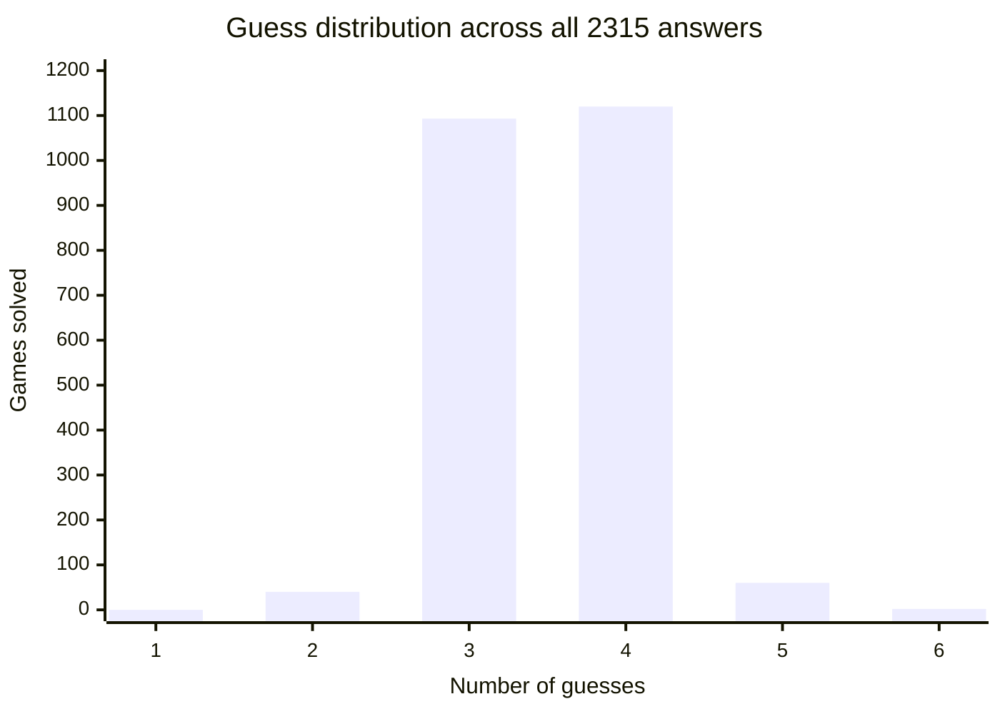

# Wordle calculator


An information theory backed bot which plays Wordle, through a greedy algorithm which always chooses the guess which provides the most bits of information at the current step.  

Arrives at correct answer in an average of 3.52 guesses

# Demo for 16/06/2026 Wordle


# Technical highlights

- Utilises Shanon's Algorithm: $E(I) = -\sum_xp(x)\log_2(p(x))$ to determine choice which yields highest entropy at each word choice.  

- Optimised algorithim to prioritise words that could actually be the answer over information near end of game

- Backtester which simulates every possible wordle game with following data:

| # Guesses | Games |
|:-------:|------:|
| 1       | 0     |
| 2       | 40    |
| 3       | 1093  |
| 4       | 1120  |
| 5       | 60    |
| 6       | 2     |
| 7+      | 0     |




# Build & Run

- Calculate entropy for each possible first guess and print in expectedValue.txt

```bash
python3 optimalFirstWord.py
```

- Run Wordle solver

```bash
python3 main.py
```