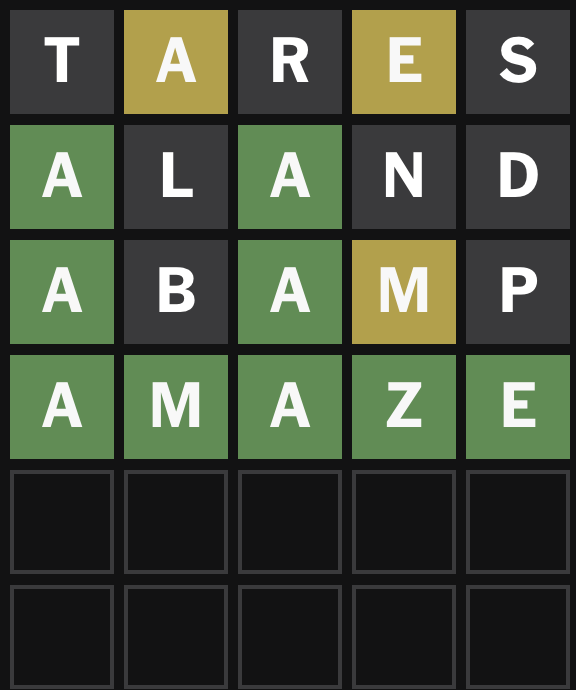

# Wordle calculator


An information theory backed bot which plays Wordle, through a greedy algorithm which always chooses the guess which provides the most bits of information at the current step.  

# Demo for 16/06/2026 Wordle



# Technical highlights

- Utilises Shanon's Algorithm: $E(I) = \sum_xp(x)\log_2(\frac{1}{p(x)})$ to determine choice which yields highest entropy at each word choice.  

# Build & Run

- Calculate entropy for each possible first guess and print in expectedValue.txt

```bash
python3 optimalFirstWord.py
```

- Run Wordle solver

```bash
python3 main.py
```